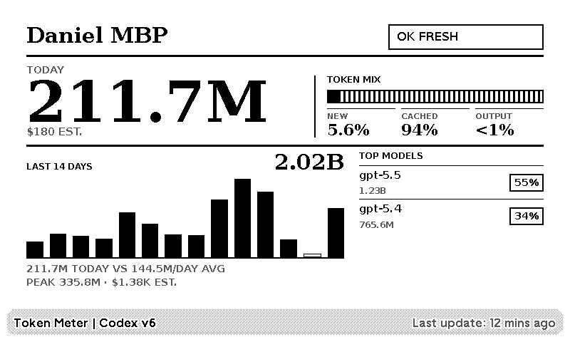

# TRMNL Token Meter CLI

<p align="center">
  
</p>

TRMNL Token Meter is a local collector for showing AI coding token usage on a TRMNL display.

The CLI runs on your computer, reads enabled local Codex, OpenCode, and Claude usage records, calculates aggregate token and estimated cost totals, and syncs those totals to your TRMNL Token Meter plugin. It is meant for people who want a private, glanceable meter for how much AI coding usage is happening today, this week, and this month.

Privacy is the core design constraint: raw usage content stays on your machine. The CLI does not upload prompts, responses, commands, diffs, file contents, repository names, or file paths. It sends only aggregate totals and status fields needed to render the TRMNL display.

## Compatibility

- Supported OS: macOS and Linux
- Supported Node: `>=22.13.0`

The package manifest enforces the OS restriction at install time.

## How It Works

1. The CLI checks which supported sources are available locally without reading usage content from sources that are not enabled.
2. It scans only the sources enabled for this device in the TRMNL Token Meter web configuration.
3. It converts those records into daily, rolling-window, and per-model aggregates.
4. It uploads only the sanitized aggregate snapshot, collector version, source availability, and enabled-source list needed by the TRMNL Token Meter backend.

The collector is designed to be useful without becoming another remote analytics pipe. Raw session content stays local.
Newly supported providers do not start syncing automatically. When a newer CLI
release detects additional supported providers, it prints a privacy note and
points you to the web configuration page to enable them.

## Quick Start

1. Install the TRMNL Token Meter plugin in TRMNL.
2. Open the plugin management page and generate a pairing code.
3. Run the CLI on the computer you want to track:

```bash
npx trmnl-token-meter
```

4. Enter the pairing code, choose a machine name, and use this backend URL when prompted:

```text
https://trmnl-token-meter-backend.trmnltkn.workers.dev
```

Setup pairs this machine, uploads the first sanitized aggregate snapshot, and installs background sync. After setup, uploads continue automatically on the configured interval.

## Install Options

Run directly from npm without a global install:

```bash
npx trmnl-token-meter
```

If you want a persistent local command instead, install from npm:

```bash
npm install -g trmnl-token-meter
trmnl-token-meter --version
```

## What Gets Sent

Each upload sends a sanitized aggregate snapshot. The CLI computes this locally before upload. Individual usage records are not sent; only aggregate data, total tokens, estimated costs, and generic status fields are sent. Token mix fields such as input, output, cache read, and cache creation stay local.

Compact representative example:

```json
{
  "schema_version": "2026-05-28.v4-14day-window",
  "machine_id": "mach_abc123",
  "machine_label": "My MacBook",
  "generated_at": "2026-05-18T12:42:57.320Z",
  "periods": {
    "today": {
      "start": "2026-05-18",
      "end": "2026-05-19",
      "total_tokens": 162000,
      "estimated_cost_usd": 1.2345,
      "cost_status": "known",
      "pricing_catalog_version": "2026-07-12.codexbar-parity",
      "warning_codes": []
    },
    "last_7_days": {
      "start": "2026-05-12",
      "end": "2026-05-19",
      "total_tokens": 680000,
      "estimated_cost_usd": 5.4321,
      "cost_status": "known",
      "pricing_catalog_version": "2026-07-12.codexbar-parity",
      "warning_codes": []
    },
    "last_14_days": {
      "start": "2026-05-05",
      "end": "2026-05-19",
      "total_tokens": 1040000,
      "estimated_cost_usd": 8.7654,
      "cost_status": "known",
      "pricing_catalog_version": "2026-07-12.codexbar-parity",
      "warning_codes": []
    },
    "last_30_days": {
      "start": "2026-04-19",
      "end": "2026-05-19",
      "total_tokens": 2120000,
      "estimated_cost_usd": 16.789,
      "cost_status": "known",
      "pricing_catalog_version": "2026-07-12.codexbar-parity",
      "warning_codes": []
    }
  },
  "daily": [
    {
      "date": "2026-05-18",
      "start": "2026-05-18",
      "end": "2026-05-19",
      "total_tokens": 162000,
      "estimated_cost_usd": 1.2345,
      "cost_status": "known",
      "pricing_catalog_version": "2026-07-12.codexbar-parity",
      "warning_codes": [],
      "has_usage": true,
      "is_missing": false
    }
  ],
  "models": [
    {
      "name": "gpt-5",
      "total_tokens": 136000,
      "estimated_cost_usd": 1.01,
      "cost_status": "known",
      "pricing_catalog_version": "2026-07-12.codexbar-parity",
      "warning_codes": []
    }
  ],
  "source_summaries": [
    {
      "provider": "codex",
      "periods": { "...": "same aggregate period shape as top-level periods" },
      "daily": [{ "...": "same daily aggregate shape" }],
      "models": [{ "...": "same model aggregate shape" }]
    }
  ],
  "collector": {
    "version": "0.1.0",
    "source": "codexbar-local-cost",
    "codex_home": "default",
    "cost_engine_version": "2026-07-12.codexbar-parity",
    "supported_providers": ["codex", "opencode", "claude"],
    "enabled_providers": ["codex"],
    "provider_statuses": [
      { "provider": "codex", "status": "available" },
      { "provider": "opencode", "status": "available" },
      { "provider": "claude", "status": "missing" }
    ],
    "sources": [
      {
        "kind": "codex_sessions",
        "enabled": true,
        "status": "read",
        "record_count": 42
      }
    ],
    "warnings": []
  }
}
```

The real upload can include up to 15 daily rows, up to 25 normalized model rows,
and optional source summaries for sources enabled in the web configuration.
Source availability is reported separately so the backend can show enablement
controls without requiring the CLI to read disabled source contents. It does not
include raw session records or anything needed to reconstruct your conversations.

## What Never Gets Sent

The CLI does not upload:

- Prompts or responses
- Tool output
- Shell commands
- File contents
- Diffs
- Absolute paths
- Repository names
- Raw Codex JSONL lines
- Raw OpenCode SQLite rows or session content
- Raw Claude project transcripts
- Priority database rows
- Pi session contents
- Auth files, browser cookies, API keys, TRMNL secrets, pairing codes, or collector tokens in aggregate uploads

No individual usage data is sent. No raw usage content is analyzed remotely. The private parts of your AI coding activity stay local.

## Commands

Open setup or the local control menu:

```bash
npx trmnl-token-meter
```

When a terminal is attached, the control menu uses arrow-key selection and Enter to confirm.

Show current pairing, background sync, and server status:

```bash
npx trmnl-token-meter status
```

Upload one snapshot immediately:

```bash
npx trmnl-token-meter sync --once
```

Add or replace the paired TRMNL meter:

```bash
npx trmnl-token-meter add
```

Revoke this machine and stop background sync:

```bash
npx trmnl-token-meter revoke
```

Remove background sync:

```bash
npx trmnl-token-meter uninstall
```

By default, `uninstall` keeps local pairing credentials. Use `uninstall --revoke` if you also want to revoke this machine from the TRMNL meter.

## Background Sync

After pairing, the CLI installs a local background job so the display keeps updating without leaving a terminal open.

- macOS: `launchd`
- Linux: `systemd` when available, otherwise `cron`

The TRMNL management page controls the collector upload cadence with `1 hour`
(default), `4 hours`, and `24 hours` presets. Running `status` or completing a
successful upload lets the CLI refresh the local scheduler when that preference
changes.

Use `npx trmnl-token-meter status` to inspect whether background sync is installed and when the last local/server sync completed.

## Non-Interactive Setup

For scripts or troubleshooting, pair manually:

```bash
npx trmnl-token-meter pair \
  --code ABCD-1234 \
  --machine-label "My MacBook" \
  --api-base-url https://trmnl-token-meter-backend.trmnltkn.workers.dev
```

Then install background sync:

```bash
npx trmnl-token-meter service install
```

Upload once:

```bash
npx trmnl-token-meter upload
```

## Test Locally

To test the CLI from this repository with a persistent local command, install it globally from the repo root:

```bash
pnpm install
pnpm build
npm install -g .
```

Then you can run the CLI directly from later terminal sessions:

```bash
trmnl-token-meter --version
trmnl-token-meter setup --api-base-url https://trmnl-token-meter-backend.trmnltkn.workers.dev
trmnl-token-meter status
```

This is useful for local development and manual testing. The public setup flow still uses `npx trmnl-token-meter`.

## Inspect Before Uploading

Use `collect` to print the exact sanitized payload locally without uploading:

```bash
npx trmnl-token-meter collect
```

This is the best way to verify what would be sent. The output is the aggregate snapshot, not raw session content.

## Local Configuration

The collector stores credentials, service metadata, and sync state locally on your machine.

- `CODEX_HOME` controls where Codex usage files are read from. Default: `~/.codex`
- `TRMNL_TOKEN_METER_OPENCODE_DB` points to a specific OpenCode SQLite database. Default: `~/.local/share/opencode/opencode.db`
- `TRMNL_TOKEN_METER_CLAUDE_CONFIG_DIR` or `TRMNL_TOKEN_METER_CLAUDE_PROJECTS_HOME` points to a Claude config or projects directory when auto-detection is not enough
- `TRMNL_TOKEN_METER_API_BASE_URL` overrides the backend URL
- `TRMNL_TOKEN_METER_CONFIG_DIR` overrides the config directory
- `TRMNL_TOKEN_METER_CACHE_DIR` overrides the cache directory
- `TRMNL_TOKEN_METER_INCLUDE_PI_SESSIONS=1` includes compatible Pi session aggregates when present
- `PI_HOME` overrides the Pi home directory. Default: `~/.pi`

Default local paths:

- macOS config: `~/Library/Application Support/trmnl-token-meter`
- macOS cache/logs: `~/Library/Caches/trmnl-token-meter`
- Linux config: `${XDG_CONFIG_HOME:-~/.config}/trmnl-token-meter`
- Linux cache/logs: `${XDG_CACHE_HOME:-~/.cache}/trmnl-token-meter`

Background service logs are written to the cache directory as `service.log` and `service.err.log`.

## Project Policies

- Security reporting: [SECURITY.md](./SECURITY.md)
- Contributing guide: [CONTRIBUTING.md](./CONTRIBUTING.md)
- Code of conduct: [CODE_OF_CONDUCT.md](./CODE_OF_CONDUCT.md)
- License: [LICENSE](./LICENSE)
- Release process: [docs/releasing.md](./docs/releasing.md)
- User-facing change log: [CHANGELOG.md](./CHANGELOG.md)

## Contributing

Contributions are welcome, especially around privacy hardening, cross-platform service behavior, documentation, and test coverage.

Before opening a pull request:

1. Install dependencies with `pnpm install`.
2. Run `pnpm typecheck`, `pnpm lint`, `pnpm test`, `pnpm test:privacy`, and `pnpm test:pack`.
3. Update docs and tests in the same change when behavior or payload shape changes.

See [CONTRIBUTING.md](./CONTRIBUTING.md) for the full contributor workflow and [CODE_OF_CONDUCT.md](./CODE_OF_CONDUCT.md) for collaboration expectations.

## License

This project is released under the [MIT License](./LICENSE).

## Local Sources

By default, the CLI reads Codex usage from `CODEX_HOME` when set, otherwise `~/.codex`. It also reads OpenCode usage from `~/.local/share/opencode/opencode.db` and scans Claude project transcripts when they exist.

Expected local inputs:

- `$CODEX_HOME/sessions/**/*.jsonl`
- `$CODEX_HOME/archived_sessions/**/*.jsonl`
- `$CODEX_HOME/logs_2.sqlite` for priority-tier cost evidence
- OpenCode SQLite database at `~/.local/share/opencode/opencode.db`
- Claude project JSONL under `CLAUDE_CONFIG_DIR/projects`, `~/.config/claude/projects`, or `~/.claude/projects` when present
- `~/.pi/agent/sessions/**/*.jsonl` only when Pi session merging is explicitly enabled

To read another Codex directory:

```bash
CODEX_HOME=/path/to/codex-home npx trmnl-token-meter collect
```

To read a specific OpenCode SQLite database:

```bash
TRMNL_TOKEN_METER_OPENCODE_DB=/path/to/opencode.db npx trmnl-token-meter collect
```

The OpenCode source reports provider `opencode` and source kind `opencode_sqlite`. The collector reads only normalized `session` columns needed for model, timestamp, token totals, and stored session cost; OpenCode costs come from `session.cost` instead of the local pricing catalog. It does not read OpenCode messages, parts, titles, paths, directories, projects, account metadata, or diff storage.

To read a specific Claude config or projects directory:

```bash
TRMNL_TOKEN_METER_CLAUDE_CONFIG_DIR=/path/to/claude-config npx trmnl-token-meter collect
TRMNL_TOKEN_METER_CLAUDE_PROJECTS_HOME=/path/to/claude/projects npx trmnl-token-meter collect
```

Pi session merging is off by default. Enable it for one command with:

```bash
npx trmnl-token-meter collect --include-pi-sessions
```

## Background Sync

Interactive setup installs background sync automatically.

On macOS, the CLI installs a user `launchd` agent. On Linux, it prefers a user `systemd` timer and falls back to cron when systemd user services are unavailable.

When you run a newer CLI release, it refreshes the installed background runner copy in place so scheduled syncs keep using the current package version.

The TRMNL management page controls the collector upload cadence with `1 hour`
(default), `4 hours`, and `24 hours` presets. The CLI reconciles that cadence on
pair, `status`, and successful uploads.

Foreground continuous mode is available for debugging:

```bash
npx trmnl-token-meter run
```

Closing the terminal stops foreground mode. Normal setup uses the background scheduler instead.

## Update Checks

Human-facing commands check npm for a newer `trmnl-token-meter` version at most once per day. Disable that check with either:

```bash
TRMNL_TOKEN_METER_DISABLE_UPDATE_CHECK=1 npx trmnl-token-meter status
npx trmnl-token-meter status --no-update-check
```

## Local Files

The CLI stores its local credential and sync metadata in the platform config directory with restrictive permissions.

- macOS: `~/Library/Application Support/trmnl-token-meter`
- Linux: `${XDG_CONFIG_HOME:-~/.config}/trmnl-token-meter`

The collector credential is used only to authenticate this machine with your TRMNL Token Meter plugin. Revoking the machine invalidates that credential.
